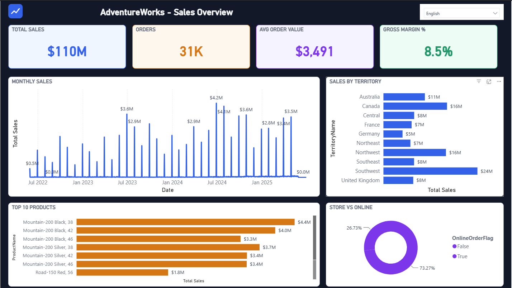
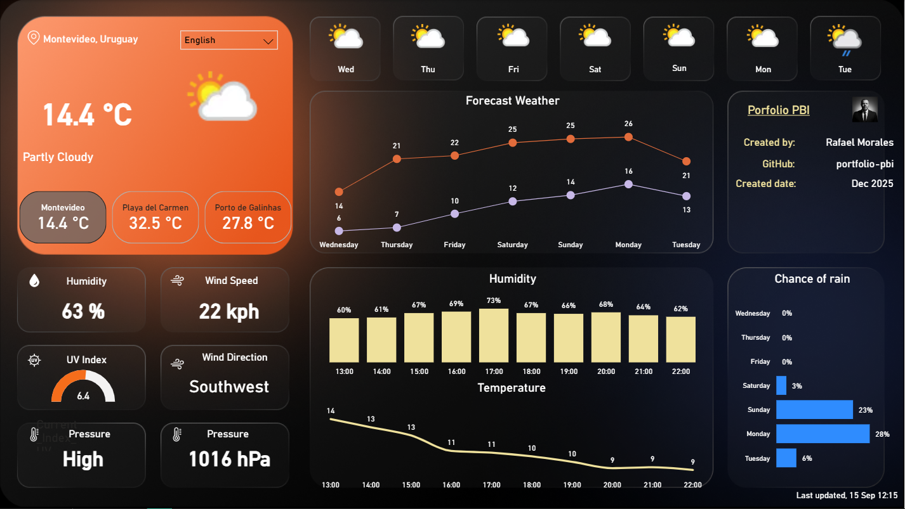

# 📊 Portfolio PBI

[English](#english) | [Español](#español)

---

<a name="english"></a>
# 📊 Portfolio PBI

A collection of Power BI dashboards, all built with the **PBIP** (Power BI Project) format for proper, text-based version control. Each project lives in its own folder with its own README.

## 📁 Projects

### 🚲 [AdventureWorks Sales & Margin Analytics](advworks/)
<a href="advworks/"></a>

A hand-built star schema over the AdventureWorks OLTP dataset (SQL Server), with DAX time intelligence, a dark dashboard theme, and dynamic bilingual card/chart titles driven from a single language selector.
**[→ View published dashboard](https://app.powerbi.com/view?r=eyJrIjoiODY4MWQ3MjYtZGI4MC00OTEwLTllYzgtYWY1YTVjNWI5ODEzIiwidCI6Ijg2ZDVlYWY3LWNjOGEtNDkzMC04MjhlLWIwNGJmYzlhYzQ1ZiJ9)** · **[→ Project details](advworks/README.md)**

### 🌤️ [Weather Dashboard](weather/)
<a href="weather/"></a>

Real-time weather data and forecasts for multiple locations, pulled live from the Open-Meteo API. Bilingual (English/Spanish) with dynamic language switching.
**[→ View published dashboard](https://app.powerbi.com/view?r=eyJrIjoiMmU4MzEwYmYtZWM5ZC00ZjQyLWFmY2UtMThkM2UzMDc0YzI0IiwidCI6Ijg2ZDVlYWY3LWNjOGEtNDkzMC04MjhlLWIwNGJmYzlhYzQ1ZiJ9)** · **[→ Project details](weather/README.md)**

## 🚀 Prerequisites

- **Power BI Desktop** (recent version, supporting the PBIP format)
- Each project may have its own additional prerequisites (an API, a local database) — see its own README

## 📦 Getting Started

```bash
git clone https://github.com/rafaelm79dev/portfolio-pbi.git
cd portfolio-pbi
```

Then open whichever project's `.pbip` file in Power BI Desktop — see that project's README for specifics (data source setup, configuration).

## 🛠️ Common Technologies

- **Power BI Desktop**, **PBIP** and **TMDL** for version-controllable reports and semantic models
- **DAX** for measures and calculations
- **Power Query (M)** for data transformation

## 👤 Author

**Rafael Morales**
- GitHub: [@rafaelm79dev](https://github.com/rafaelm79dev)
- LinkedIn: [Rafael Morales](https://www.linkedin.com/in/rafaelm79)

## 📞 Contact

If you have questions or suggestions, feel free to open an issue or contact me directly.

---

<a name="español"></a>
# 📊 Portfolio PBI

Una colección de dashboards de Power BI, todos construidos con el formato **PBIP** (Power BI Project) para un control de versiones real, basado en texto. Cada proyecto vive en su propia carpeta con su propio README.

## 📁 Proyectos

### 🚲 [AdventureWorks Sales & Margin Analytics](advworks/)
<a href="advworks/"></a>

Un modelo en estrella armado a medida sobre el dataset OLTP de AdventureWorks (SQL Server), con time intelligence en DAX, tema oscuro, y títulos de tarjetas/gráficos bilingües dinámicos controlados desde un único selector de idioma.
**[→ Ver dashboard publicado](https://app.powerbi.com/view?r=eyJrIjoiODY4MWQ3MjYtZGI4MC00OTEwLTllYzgtYWY1YTVjNWI5ODEzIiwidCI6Ijg2ZDVlYWY3LWNjOGEtNDkzMC04MjhlLWIwNGJmYzlhYzQ1ZiJ9)** · **[→ Detalles del proyecto](advworks/README.md)**

### 🌤️ [Weather Dashboard](weather/)
<a href="weather/"></a>

Datos meteorológicos y pronósticos en tiempo real para múltiples ubicaciones, obtenidos en vivo desde la API de Open-Meteo. Bilingüe (Español/Inglés) con cambio dinámico de idioma.
**[→ Ver dashboard publicado](https://app.powerbi.com/view?r=eyJrIjoiMmU4MzEwYmYtZWM5ZC00ZjQyLWFmY2UtMThkM2UzMDc0YzI0IiwidCI6Ijg2ZDVlYWY3LWNjOGEtNDkzMC04MjhlLWIwNGJmYzlhYzQ1ZiJ9)** · **[→ Detalles del proyecto](weather/README.md)**

## 🚀 Requisitos Previos

- **Power BI Desktop** (versión reciente que soporte el formato PBIP)
- Cada proyecto puede tener requisitos adicionales propios (una API, una base de datos local) — ver su propio README

## 📦 Cómo Empezar

```bash
git clone https://github.com/rafaelm79dev/portfolio-pbi.git
cd portfolio-pbi
```

Luego abrí el archivo `.pbip` del proyecto que quieras en Power BI Desktop — ver el README de ese proyecto para detalles específicos (configuración de la fuente de datos, etc.).

## 🛠️ Tecnologías Comunes

- **Power BI Desktop**, **PBIP** y **TMDL** para reportes y modelos semánticos versionables
- **DAX** para medidas y cálculos
- **Power Query (M)** para transformación de datos

## 👤 Autor

**Rafael Morales**
- GitHub: [@rafaelm79dev](https://github.com/rafaelm79dev)
- LinkedIn: [Rafael Morales](https://www.linkedin.com/in/rafaelm79)

## 📞 Contacto

Si tenés preguntas o sugerencias, no dudes en abrir un issue o contactarme directamente.

---

⭐ Si te gusta este proyecto, ¡dale una estrella en GitHub!
