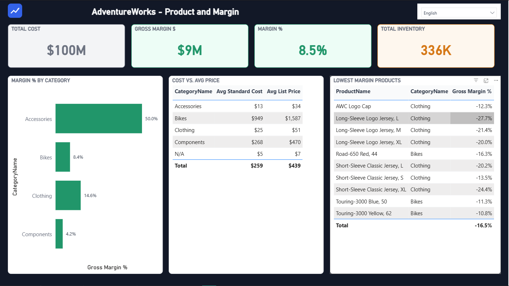
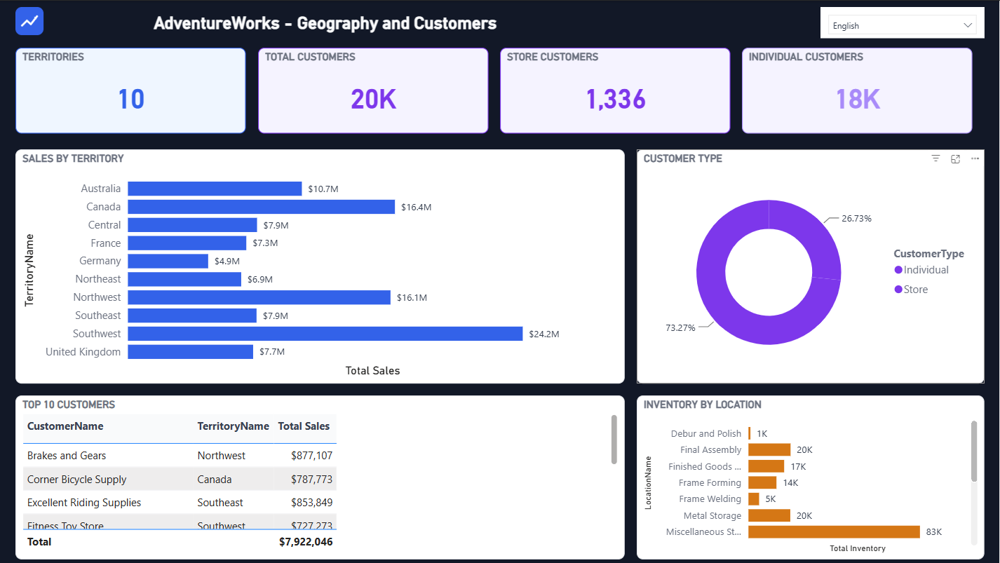

# 🚲 AdventureWorks Sales & Margin Analytics

[English](#english) | [Español](#español)

---

<a name="english"></a>
# 🚲 AdventureWorks Sales & Margin Analytics

A Power BI portfolio dashboard built on the classic **AdventureWorks OLTP** dataset, using the **PBIP** (Power BI Project) format with a hand-built star schema, DAX time intelligence, and a fully bilingual, dynamically-themed report.

## 🎯 Skills Demonstrated

`Data Modeling (Star Schema)` · `DAX (Time Intelligence, Margin Calcs)` · `SQL Server` · `Power Query (M)` · `Report Design & Theming` · `Dashboard Localization (EN/ES)` · `PBIP / Git Version Control`

## 💼 The Challenge & Approach

**The problem:** raw OLTP transaction data tells you what sold, but not what's actually profitable. Sales, cost, and customer data live in dozens of normalized tables at different grains — not something a stakeholder can open and read, and not something DAX can calculate against efficiently.

**The approach:** rather than importing the OLTP tables as-is, I designed a purpose-built star schema on top of the source data (SQL Server) — fact tables at line-item grain, conformed dimensions, a proper calendar table — then layered DAX time-intelligence and margin measures on top. The report itself is a design exercise as much as a data one: a dark-themed, 3-page dashboard with an invented brand mark, gradient-highlighted "leader" bars, and card/chart titles that switch language live from a dropdown — all without duplicating a single visual.

**The result:** a dashboard that surfaces insights the raw data hides — for example, several Clothing products turned out to be selling *below* their standard cost (as low as **-27.7% margin**), invisible at the category-revenue level but obvious once cost and margin are modeled properly.

## 🔗 Published Dashboard

**👉 [View Dashboard on Power BI Service](https://app.powerbi.com/view?r=eyJrIjoiODY4MWQ3MjYtZGI4MC00OTEwLTllYzgtYWY1YTVjNWI5ODEzIiwidCI6Ijg2ZDVlYWY3LWNjOGEtNDkzMC04MjhlLWIwNGJmYzlhYzQ1ZiJ9)**

<table>
<tr>
<td></td>
<td></td>
<td></td>
</tr>
<tr>
<td align="center"><sub>Sales Overview</sub></td>
<td align="center"><sub>Product and Margin</sub></td>
<td align="center"><sub>Geography and Customers</sub></td>
</tr>
</table>

## ✨ Features

- 🏗️ **Hand-built star schema**: fact tables at line-item grain, conformed dimensions, a calculated calendar table — not a straight OLTP-to-report import
- 📊 **3 report pages**: Sales Overview, Product and Margin, Geography and Customers
- 🧮 **DAX time intelligence**: YTD, prior-year, and YoY% measures alongside margin and average-order-value calculations
- 🌐 **Dynamic bilingual UI (English / Spanish)**: every card and chart title is a DAX measure bound to the visual's title via conditional formatting, switched live by a single language dropdown (synced across all 3 pages) — no duplicated visuals, no page duplication
- 🎨 **Dark dashboard theme**: dark page background with light card/chart containers, per-metric accent colors (blue = sales, green = margin, orange = volume/stock, purple = geography/customers), and value-gradient bars that highlight the top performer in each ranked chart
- 🖼️ **Custom brand mark**: a small generated logo, registered as a report static resource
- 📦 **PBIP format**: text-based project files for proper version control

## 🏗️ Project Structure

```
advworks/
├── portfolio-pbi-adventureWorks.pbip       # Main project file
├── adventureWorks.Report/                 # Report definition
│   ├── definition/
│   │   └── pages/                         # sales_overview, product_margin, geo_customers
│   └── StaticResources/
│       └── RegisteredResources/           # aw_logo.png
└── adventureWorks.SemanticModel/          # Semantic model
    └── definition/
        ├── tables/                        # DimProduct, DimCustomer, DimTerritory,
        │                                  # DimLocation, Calendar, Lang,
        │                                  # Fact_Sales, Fact_ProductInventory
        └── relationships.tmdl

# Sibling folder (not part of the PBIP project itself):
../adventureworks/                         # Raw AdventureWorks OLTP CSVs + instawdb.sql,
                                            # used only to seed the local SQL Server database
```

## 🗃️ Data Model

**Fact tables**
- `Fact_Sales` — order-line grain (`Sales.SalesOrderDetail` joined to `Sales.SalesOrderHeader`)
- `Fact_ProductInventory` — current stock by product and location

**Dimensions**
- `DimProduct` — product, subcategory, category, standard cost, list price
- `DimCustomer` — unifies retail Stores and Individual customers from `Sales.Customer`
- `DimTerritory`, `DimLocation`
- `Calendar` — calculated date table (2022–2025), marked as the model's date table
- `Lang` — a 2-row language table (`en-US` / `es-ES`) driving every dynamic title measure

**Key measures**: Total Sales, Order Count, Avg Order Value, Total Cost, Gross Margin / Gross Margin %, Sales YTD / Sales PY / Sales YoY %, Total Inventory, Territory/Customer counts.

## 🚀 Prerequisites

- **Power BI Desktop** (recent version supporting PBIP format)
- **SQL Server** (local instance is fine) with the `AdventureWorks` OLTP database loaded — see `../adventureworks/instawdb.sql`

## 📦 Installation

1. **Get the AdventureWorks OLTP CSVs** (not included in this repo — see [Note on the raw dataset](#note-on-the-raw-dataset))

2. **Load the data source** (once)
   ```bash
   sqlcmd -S localhost -C -i ../adventureworks/instawdb.sql
   ```
   `instawdb.sql` expects the CSVs to sit alongside it in `../adventureworks/` — adjust the `SqlSamplesSourceDataPath` variable near the top of the script to an absolute path if needed. It creates and populates the `AdventureWorks` database from those CSVs.

2. **Open the project in Power BI Desktop**
   - `File` → `Open` → `Open Power BI project`
   - Select `portfolio-pbi-adventureWorks.pbip`
   - Power BI connects to the semantic model's tables, which pull from `Sql.Database("localhost", "AdventureWorks")`

## 📝 Usage

1. Open the `.pbip` file in Power BI Desktop
2. Use the **language dropdown** (top-right of each page) to switch every card/chart title between English and Spanish — the underlying data stays as-is
3. Navigate the 3 pages via the tabs at the bottom: **Sales Overview** → **Product and Margin** → **Geography and Customers**

## 🛠️ Technologies Used

- **Power BI Desktop / PBIP**: report and semantic model, version-controlled as text
- **SQL Server**: data source for the star schema
- **TMDL**: Tabular Model Definition Language for the semantic model
- **DAX**: measures, time intelligence, and the bilingual title-switching logic
- **pbi-cli**: scripted model and report authoring (tables, relationships, measures, visuals, conditional formatting) against a live Power BI Desktop session

## 📌 Note on the Raw Dataset

The `../adventureworks/` folder ships `instawdb.sql` (the install script, with a couple of BULK INSERT fixes applied) but **not** the ~90MB of source CSVs — they're Microsoft's own sample data, not something worth bloating a portfolio repo with. Grab them from Microsoft's [AdventureWorks samples](https://learn.microsoft.com/en-us/sql/samples/adventureworks-install-configure) and drop them into `../adventureworks/` before running the script.

## 🙏 Acknowledgments

- Microsoft's [AdventureWorks sample databases](https://learn.microsoft.com/en-us/sql/samples/adventureworks-install-configure) for the source dataset

---

<a name="español"></a>
# 🚲 AdventureWorks Sales & Margin Analytics

Un dashboard de portfolio en Power BI construido sobre la clásica base de datos **AdventureWorks OLTP**, usando el formato **PBIP** (Power BI Project) con un modelo en estrella armado a medida, time intelligence en DAX, y un reporte bilingüe con tema dinámico.

## 🎯 Habilidades Demostradas

`Modelado de Datos (Star Schema)` · `DAX (Time Intelligence, Cálculo de Márgenes)` · `SQL Server` · `Power Query (M)` · `Diseño y Theming de Reportes` · `Localización de Dashboards (EN/ES)` · `PBIP / Control de Versiones con Git`

## 💼 El Desafío y el Enfoque

**El problema:** los datos transaccionales crudos dicen qué se vendió, pero no qué es realmente rentable. Ventas, costos y clientes viven en decenas de tablas normalizadas a distinto grano — algo que ningún stakeholder puede abrir y leer, y que DAX no puede calcular de forma eficiente tal cual está.

**El enfoque:** en vez de importar las tablas OLTP tal cual, diseñé un modelo en estrella a medida sobre la fuente (SQL Server) — tablas de hechos a nivel de línea, dimensiones conformadas, una tabla de calendario propiamente dicha — y encima medidas DAX de time intelligence y margen. El reporte en sí es tanto un ejercicio de diseño como de datos: un dashboard de 3 páginas con tema oscuro, una marca inventada, barras con degradado que resaltan al "líder" de cada ranking, y títulos de tarjetas/gráficos que cambian de idioma en vivo desde un selector — todo sin duplicar un solo visual.

**El resultado:** un dashboard que revela lo que los datos crudos esconden — por ejemplo, varios productos de la categoría Indumentaria resultaron venderse *por debajo* de su costo estándar (hasta **-27.7% de margen**), algo invisible a nivel de ingresos por categoría pero evidente una vez que se modela bien el costo y el margen.

## 🔗 Dashboard Publicado

**👉 [Ver Dashboard en Power BI Service](https://app.powerbi.com/view?r=eyJrIjoiODY4MWQ3MjYtZGI4MC00OTEwLTllYzgtYWY1YTVjNWI5ODEzIiwidCI6Ijg2ZDVlYWY3LWNjOGEtNDkzMC04MjhlLWIwNGJmYzlhYzQ1ZiJ9)**

<table>
<tr>
<td></td>
<td></td>
<td></td>
</tr>
<tr>
<td align="center"><sub>Resumen de Ventas</sub></td>
<td align="center"><sub>Producto y Márgenes</sub></td>
<td align="center"><sub>Geografía y Clientes</sub></td>
</tr>
</table>

## ✨ Características

- 🏗️ **Modelo en estrella armado a medida**: tablas de hechos a nivel de línea, dimensiones conformadas, una tabla de calendario calculada — no es una importación directa del OLTP
- 📊 **3 páginas de reporte**: Sales Overview, Product and Margin, Geography and Customers (las pestañas están en inglés; el contenido de adentro sí cambia con el selector de idioma)
- 🧮 **Time intelligence en DAX**: medidas YTD, año anterior y variación % interanual, junto con margen y ticket promedio
- 🌐 **UI bilingüe dinámica (Español / Inglés)**: cada título de tarjeta y gráfico es una medida DAX bindeada al título del visual vía formato condicional, que cambia en vivo desde un único selector de idioma (sincronizado entre las 3 páginas) — sin duplicar visuales ni páginas
- 🎨 **Tema oscuro**: fondo de página oscuro con tarjetas/gráficos claros, color de acento por métrica (azul = ventas, verde = margen, naranja = volumen/stock, violeta = geografía/clientes), y barras con degradado que resaltan el valor más alto de cada ranking
- 🖼️ **Marca inventada**: un logo generado, registrado como recurso estático del reporte
- 📦 **Formato PBIP**: archivos de proyecto en texto plano para control de versiones real

## 🏗️ Estructura del Proyecto

```
advworks/
├── portfolio-pbi-adventureWorks.pbip       # Archivo principal del proyecto
├── adventureWorks.Report/                 # Definición del reporte
│   ├── definition/
│   │   └── pages/                         # sales_overview, product_margin, geo_customers
│   └── StaticResources/
│       └── RegisteredResources/           # aw_logo.png
└── adventureWorks.SemanticModel/          # Modelo semántico
    └── definition/
        ├── tables/                        # DimProduct, DimCustomer, DimTerritory,
        │                                  # DimLocation, Calendar, Lang,
        │                                  # Fact_Sales, Fact_ProductInventory
        └── relationships.tmdl

# Carpeta hermana (no forma parte del proyecto PBIP en sí):
../adventureworks/                         # CSVs crudos de AdventureWorks OLTP + instawdb.sql,
                                            # usados solo para cargar el SQL Server local
```

## 🗃️ Modelo de Datos

**Tablas de hechos**
- `Fact_Sales` — grano de línea de orden (`Sales.SalesOrderDetail` unido a `Sales.SalesOrderHeader`)
- `Fact_ProductInventory` — stock actual por producto y ubicación

**Dimensiones**
- `DimProduct` — producto, subcategoría, categoría, costo estándar, precio de lista
- `DimCustomer` — unifica clientes tipo Tienda e Individuales de `Sales.Customer`
- `DimTerritory`, `DimLocation`
- `Calendar` — tabla de fechas calculada (2022–2025), marcada como tabla de fechas del modelo
- `Lang` — tabla de idioma de 2 filas (`en-US` / `es-ES`) que alimenta cada medida de título dinámico

**Medidas clave**: Total Sales, Order Count, Avg Order Value, Total Cost, Gross Margin / Gross Margin %, Sales YTD / Sales PY / Sales YoY %, Total Inventory, conteos de territorios/clientes.

## 🚀 Requisitos Previos

- **Power BI Desktop** (versión reciente que soporte formato PBIP)
- **SQL Server** (una instancia local alcanza) con la base `AdventureWorks` OLTP cargada — ver `../adventureworks/instawdb.sql`

## 📦 Instalación

1. **Conseguí los CSV de AdventureWorks OLTP** (no están incluidos en este repo — ver [Nota sobre el dataset crudo](#nota-sobre-el-dataset-crudo))

2. **Cargar la fuente de datos** (una sola vez)
   ```bash
   sqlcmd -S localhost -C -i ../adventureworks/instawdb.sql
   ```
   `instawdb.sql` espera que los CSV estén junto a él en `../adventureworks/` — ajustá la variable `SqlSamplesSourceDataPath` al principio del script a una ruta absoluta si hace falta. Crea y carga la base `AdventureWorks` a partir de esos CSV.

2. **Abrir el proyecto en Power BI Desktop**
   - `Archivo` → `Abrir` → `Abrir proyecto de Power BI`
   - Selecciona `portfolio-pbi-adventureWorks.pbip`
   - Power BI conecta las tablas del modelo semántico, que leen desde `Sql.Database("localhost", "AdventureWorks")`

## 📝 Uso

1. Abre el archivo `.pbip` en Power BI Desktop
2. Usa el **selector de idioma** (arriba a la derecha de cada página) para cambiar todos los títulos de tarjetas/gráficos entre español e inglés — los datos en sí no cambian
3. Navegá las 3 páginas con las pestañas de abajo: **Sales Overview** → **Product and Margin** → **Geography and Customers**

## 🛠️ Tecnologías Utilizadas

- **Power BI Desktop / PBIP**: reporte y modelo semántico, versionados como texto
- **SQL Server**: fuente de datos del modelo en estrella
- **TMDL**: Tabular Model Definition Language para el modelo semántico
- **DAX**: medidas, time intelligence, y la lógica de cambio de idioma dinámico
- **pbi-cli**: autoría scripteada del modelo y el reporte (tablas, relaciones, medidas, visuales, formato condicional) contra una sesión en vivo de Power BI Desktop

## 📌 Nota sobre el Dataset Crudo

La carpeta `../adventureworks/` incluye `instawdb.sql` (el script de instalación, con un par de fixes en los BULK INSERT aplicados) pero **no** los ~90MB de CSV originales — son datos de ejemplo de Microsoft, no algo que valga la pena inflar en un repo de portfolio. Descargalos de las [bases de datos de ejemplo AdventureWorks](https://learn.microsoft.com/en-us/sql/samples/adventureworks-install-configure) de Microsoft y ponelos en `../adventureworks/` antes de correr el script.

## 🙏 Agradecimientos

- Las [bases de datos de ejemplo AdventureWorks](https://learn.microsoft.com/en-us/sql/samples/adventureworks-install-configure) de Microsoft, por el dataset original
